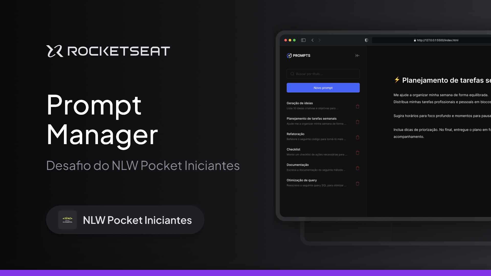

<h1 align="center">
  Prompt Manager | 
</h1>

  
  
  
  
  
  
  
  

  
  
  

  <a href="#-Sobre">Sobre</a>&nbsp;&nbsp;&nbsp;|&nbsp;&nbsp;&nbsp;
  <a href="#-Tecnologias">Tecnologias</a>&nbsp;&nbsp;&nbsp;|&nbsp;&nbsp;&nbsp;
  <a href="#-Sobre">Layout</a>&nbsp;&nbsp;&nbsp;|&nbsp;&nbsp;&nbsp;
  <a href="#-Entre-em-contato">Contato</a>

## 📚 Sobre

    

_Prompt Manager_ é uma aplicação web prática e intuitiva que permite organizar todos os seus prompts de Inteligência Artificial em um só lugar.

Com ele, você pode cadastrar, editar e buscar rapidamente os prompts que mais utiliza no dia a dia, aumentando sua produtividade e evitando perder tempo procurando informações espalhadas em anotações ou arquivos.

Esse trabalho foi desenvolvido durante a _Next Level Week_, workshop gratuito da <a href="https://rocketseat.com.br/" target="_blank">Rocketseat</a>, promovido entre 06 e 09 de outubro de 2025.

O objetivo da _NLW_ é levar a pessoa estudante para o próximo nível, independentemente do seu momento de carreira. Ele acontece poucas vezes no ano, sempre com data pra começar e terminar e, a cada edição, traz um tema e desafio diferentes, garantindo aprendizado atualizado, prático e transformador.

Acesse o projeto finalizado, online, [aqui](https://angelicaalbuquerque.github.io/nlw-prompt-manager_rocketseat/).

## 🚀 Tecnologias

Esse projeto foi desenvolvido com as seguintes tecnologias:

- HTML
- CSS
- JavaScript
- Git
- Github
- Figma
- IA (Veja [aqui](https://github.com/angelicaalbuquerque/nlw-prompt-manager_rocketseat/blob/main/prompts.md) os prompts que utilizei)

## 🎨 Layout

Você pode visualizar o layout do projeto através [deste link](https://www.figma.com/community/file/1554529095872857492), no [Figma](http://figma.com/). É preciso ter uma conta na plataforma para acessá-lo.

## 📬 Entre em contato!

    
  
  
  <!--  -->

---

Feito com ☕ e 💖 por Angélica Albuquerque

 

